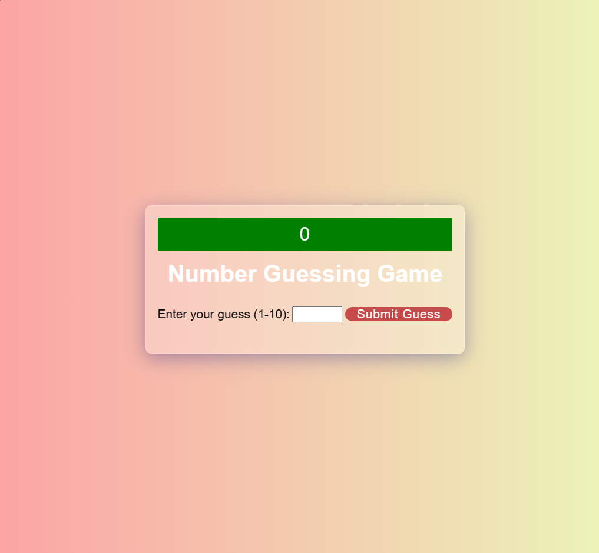

# GuessingGame

This is a simple number guessing game implemented using HTML, CSS, and JavaScript. The user is prompted to guess a randomly generated number between 1 and 10, and feedback is provided based on whether the guess is too high, too low, or correct.

App usage:
Randomly generated target number.
User input through a form for guessing.
Feedback messages for each guess.
Game ends when the correct number is guessed.

